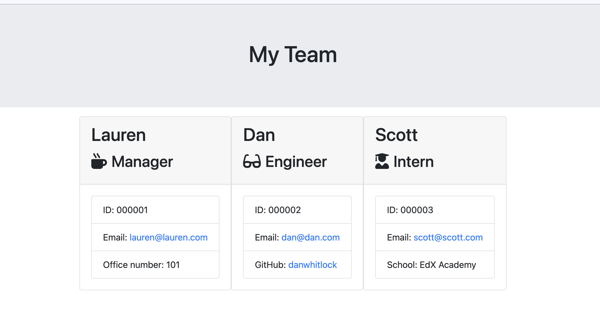

# Team Profile Generator

  ## Description
  This application will create a team profile  html file containing the details of all team mebers, based upon user input.  Users run the js file and enter team member information, and a profile page is dynamically created containing cards for each team member.

  

  ## Contents
   - [Installation](#Installation)
   - [Usage](#Usage)
   - [License](#License)
   - [Contributions](#Contributions)
   - [Testing](#Testing)
   - [Questions](#Questions)

  ## Installation
  Run npm install to ensure the required dependencies are in place
  
  ## Usage
  Initiate the app by running node index.js, follow the terminal prompts and an html file will be created in the output directory.

  
  
  ## License
  None

  ## Contributing
  If you wish to contribute, get in touch or open an issue on my page

  ## Testing
  Run npm test to ensure all tests pass

  ## Questions
  If you have any questions, reach out to me at danwhitlock@hotmail.co.uk or open an issue on my github page: https://github.com/danwhitlock.
